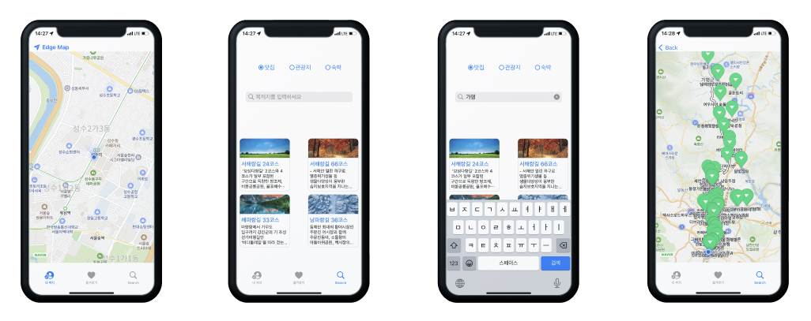

# EdgeMap
---
## 프로젝트 목적
* Alamofire를 사용한 HTTP 네트워킹을 학습하기 위한 프로젝트 입니다.
---
## 프로젝트 설명
* 사용기술

      
  
  
* 개발환경

   
 
* 기능설명
  * TabBar에 있는 내 위치를 탭하면 현재 위치를 알 수 있습니다.
  * 검색을 탭하면 맛집, 관광지, 숙박 중 원하는 정보를 선택하고 검색창에 원하는 지역을 검색할 수 있습니다.
  * 검색 결과창에서는 현재 위치에서 겁색한 지역까지 가는 경로에 선택한 정보(맛집 또는 관광지 또는 숙박)를 마커를 통해 확인할 수 있습니다. 

